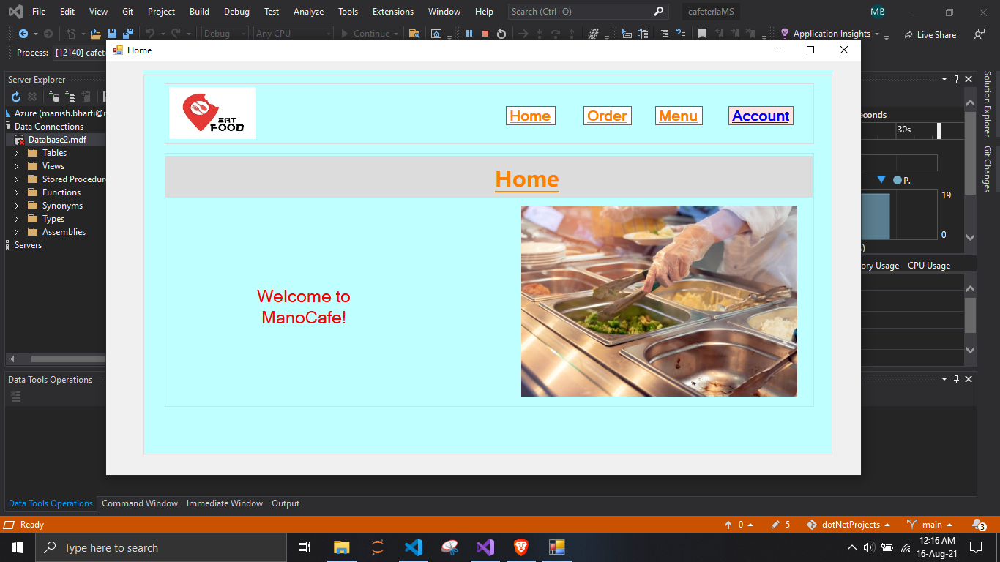
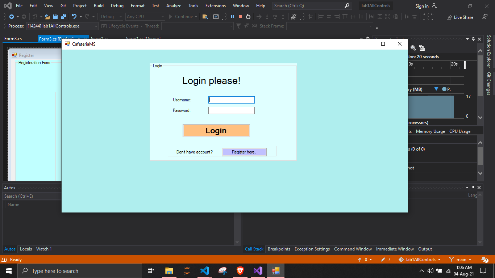

# .netProjects

# .netProjects

## Screenshots

### 16/08/2021

  <h3>Home Updated</h3>
  

  <h3>Order</h3>
  

  <h3>Menu</h3>
  

  <h3>Add new food</h3>
  

### Old screenshots

  <h3>Login Form</h3>
  

  <h3>Registration</h3>
  

  <h3>loginSuccess</h3>
  

  <h3>Home</h3>
  

