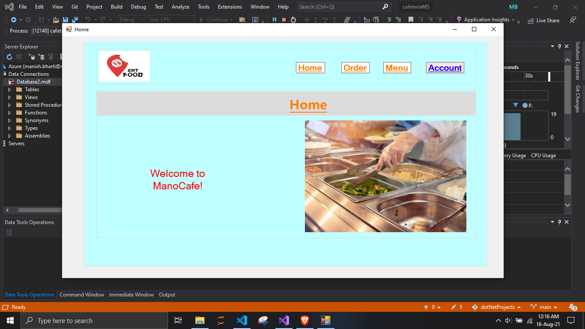
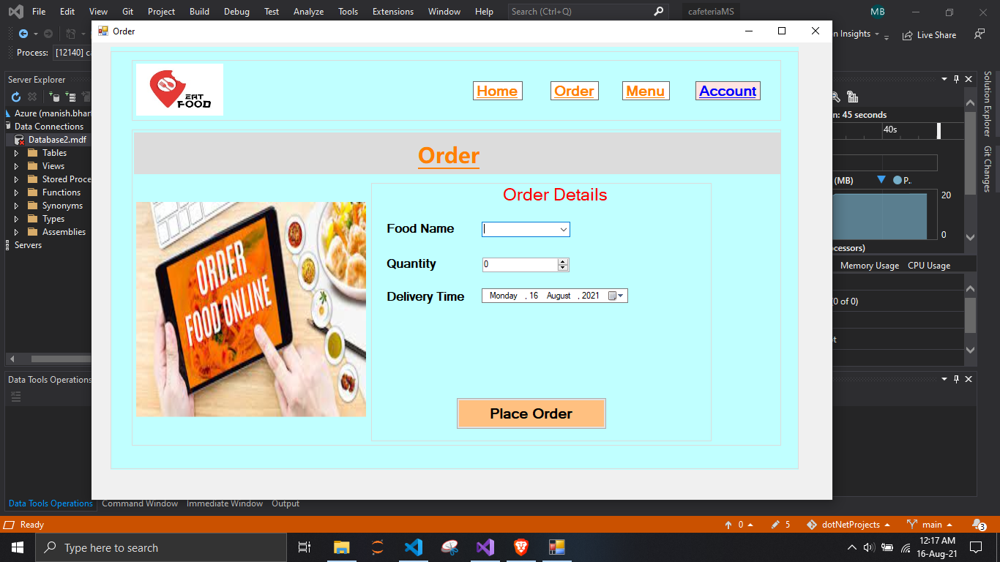
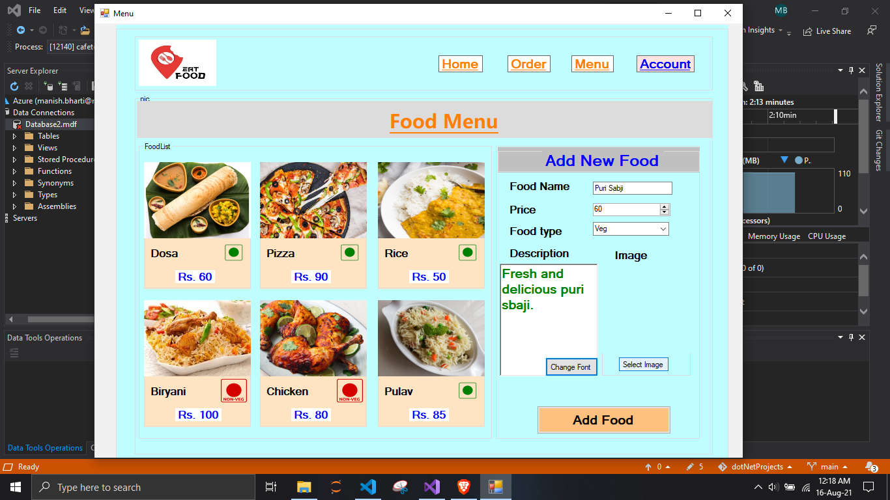

## Lab2

1. Datetimepicker
2. Numeric updown
3. Month Calander
4. Rich textbox
5. Save Dialogue control
6. Font Dialogue Control
7. Open Dialogue Control

## Screenshots

  <h3>Home Updated</h3>
  

  <h3>Order</h3>
  

  <h3>Menu</h3>
  

  <h3>Add new food</h3>
  

