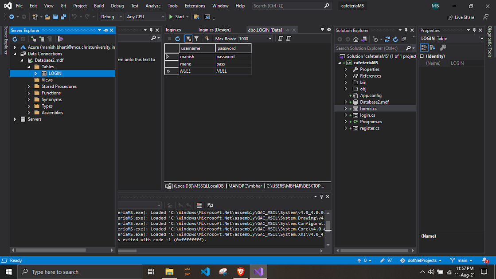

## Lab3: DB with domain pgm

## Screenshots

  <h3>LoginTable</h3>
  

  <h3>Login Using Database</h3>
  

 

  <h3>Home Updated</h3>
  

  <h3>Order</h3>
  

  <h3>Menu</h3>
  

  <h3>Add new food</h3>
  

